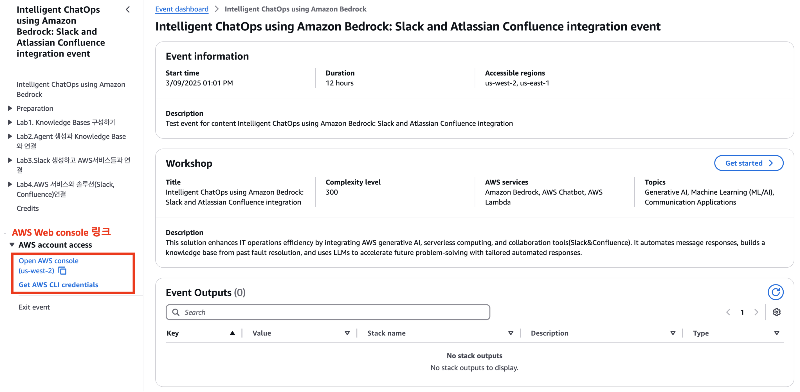

# Step-1. AWS Account

## 환경설정
이 문서는 실습 환경을 준비하는 과정을 단계별로 설명합니다.

## 실습 계정 접속

### 1.이메일 OTP 인증 선택

### 2. 이메일로 전송된 Passcode 입력

### 3. AWS 콘솔 열기

로딩되는 진입 페이지 하단에 Terms and Conditions 체크 후 Join Event 클릭

좌측 하단의 Open AWS console 버튼을 클릭하여 실습 계정으로 이동합니다.

