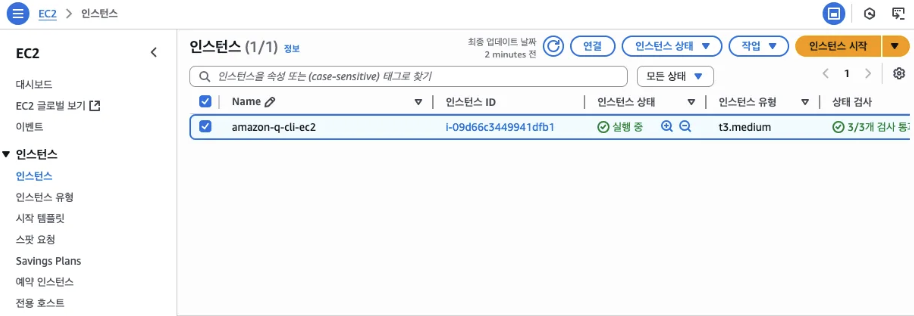
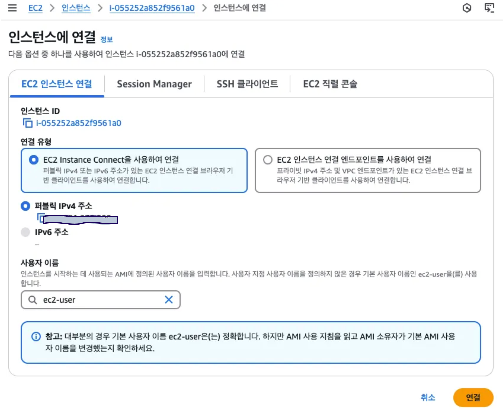
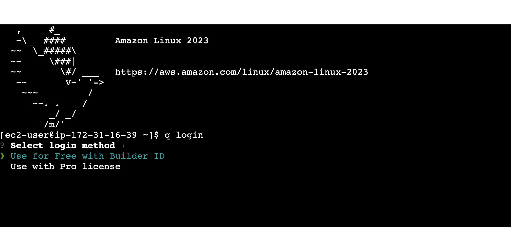
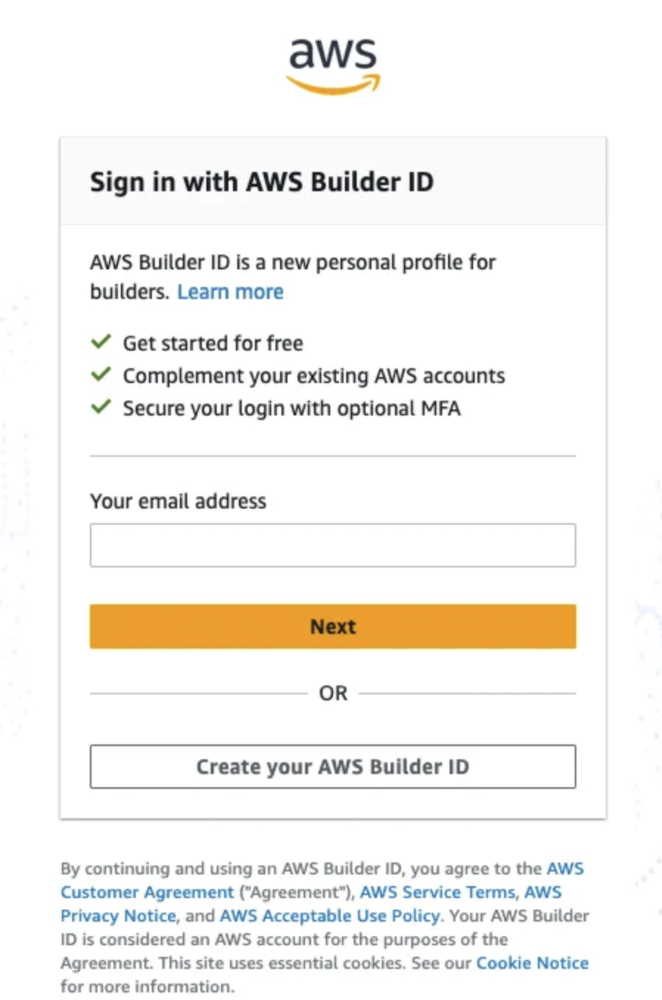
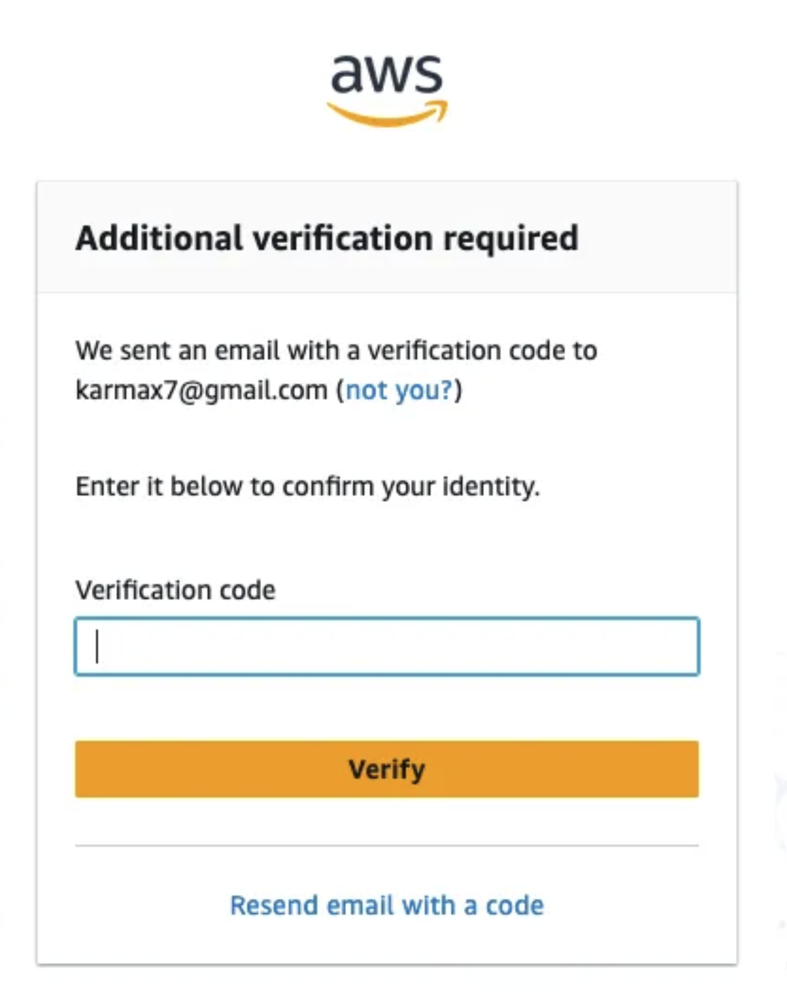
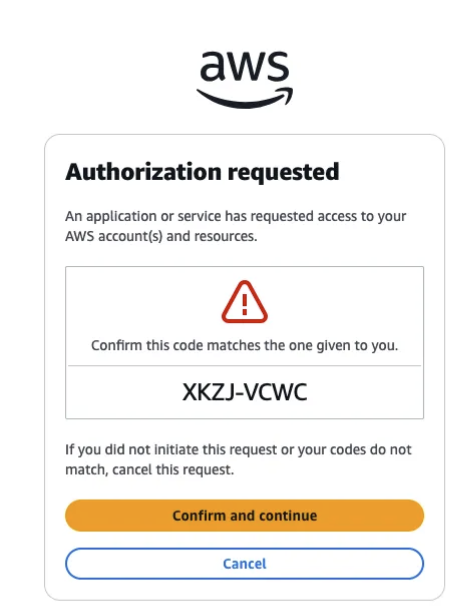
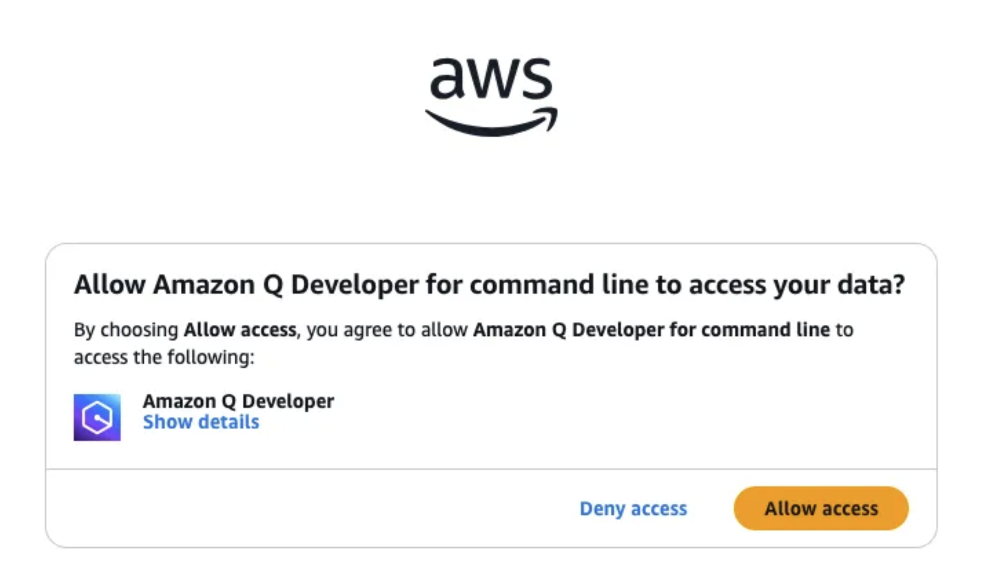
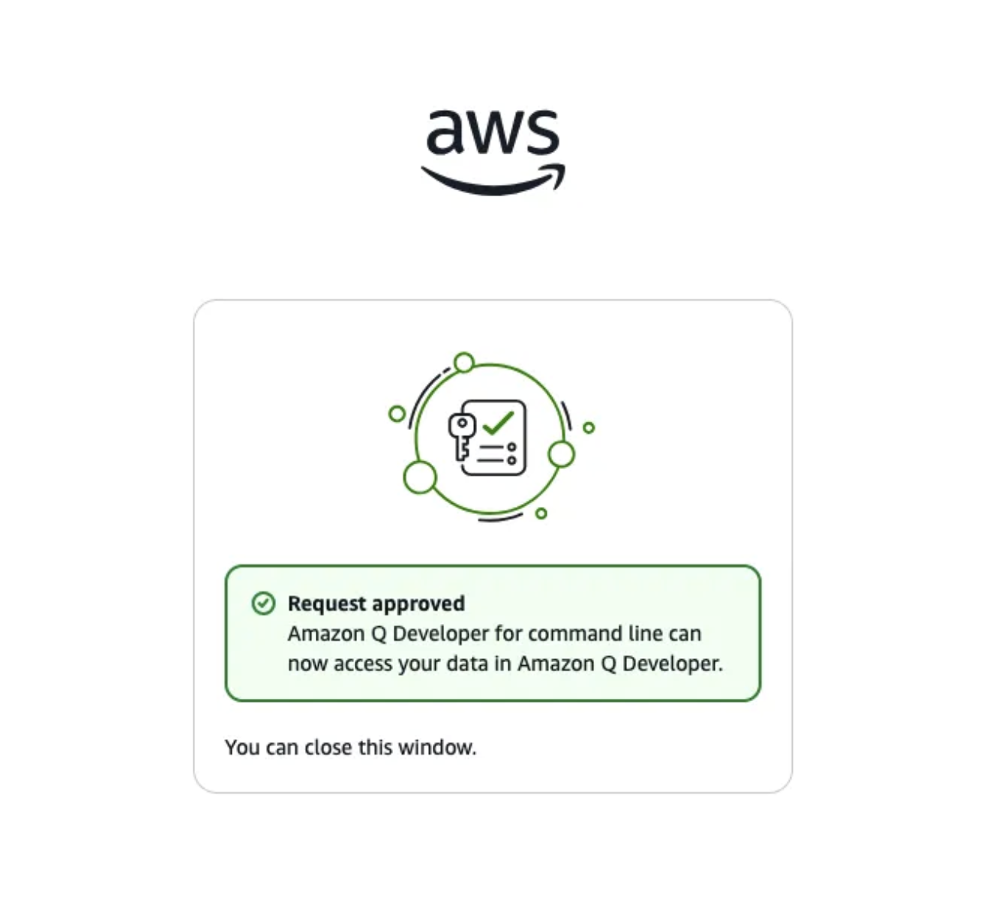
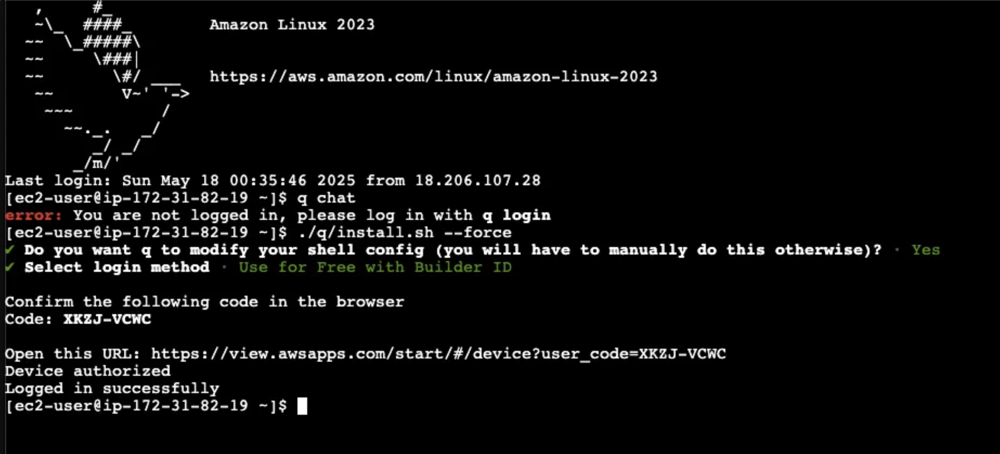
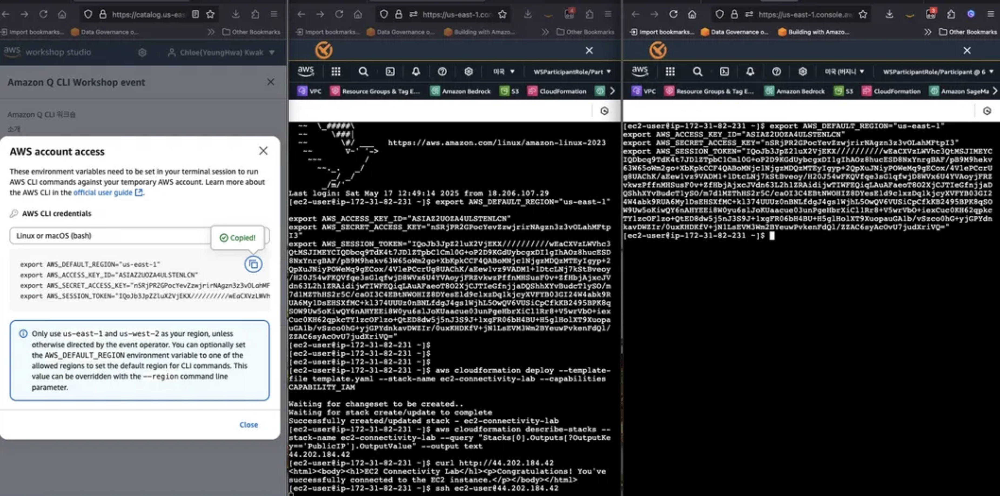

# Step-2. 실습환경 구성

### 1.EC2 연결
EC2 콘솔로 이동한 뒤 호스트 인스턴스에 “인스턴스연결” 방식으로 연결합니다.







### 2. Amazon Q Developer CLI 인증
```bash
q login
```

EC2 인스턴스 연결하면 이미 Amazon Q Developer가 설치가 되어 있습니다. q login을 통해서 로그인을 시작합니다.




**👉** 기존에 AWS Builder ID가 없는 경우, 이를 [생성](https://docs.aws.amazon.com/ko_kr/signin/latest/userguide/create-aws_builder_id.html)합니다.

https://profile.aws.amazon.com/












**[Q CLI 로그인 성공화면]**




### 3. AWS Credential을 터미널에 적용

Workshop Studio에서 제공하는 AWS Cli Credential을 터미널에서 복사해서 적용합니다.


