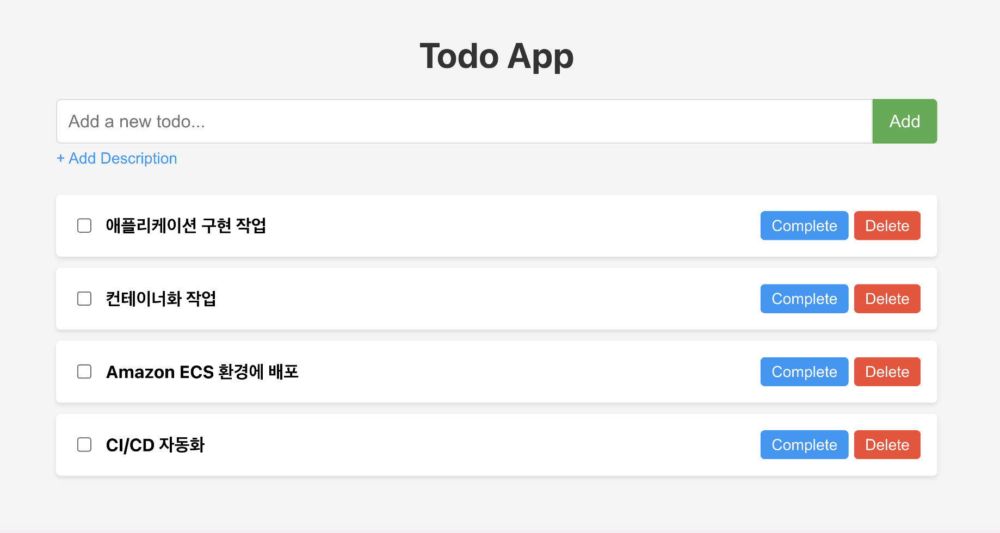

# Lab1. 클라우드 아키텍처 설계 및 구축
### Step-1. To-do 애플리케이션 개발
Amazon Q Developer를 활용하여 간단하게 할 태스크를 등록하고 업데이트할 수 있는 웹 애플리케이션을 개발합니다.

### Step-2. AWS 클라우드 아키텍처 설계 및 구축
Step 1에서 개발한 애플리케이션을 AWS 클라우드에 배포하기 위해 아키텍처를 설계하고 IaC코드를 생성해 봅니다.

### Step-3. Amazon ECS 환경 배포 및 검증
Amazon ECS 환경에 애플리케이션 배포해보고 실제 동작을 확인해 봅니다.

