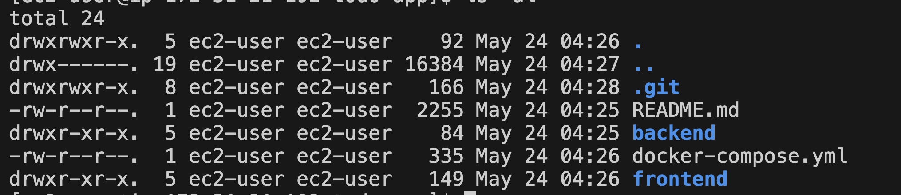

# Step-1. To-do 애플리케이션 개발

## 실습 개요
이 실습에서는 Amazon Q CLI를 사용하여 To-do 애플리케이션을 개발과 배포하는 방법을 배웁니다. 그리고 컨테이너화된 애플리케이션 로컬 환경에서 테스트를 해보도록 합니다. 그리고 AWS 클라우드 환경에서 애플리케이션을 배포하기 위해 인프라를 설계하고 구축하는 방법을 직접 체험해 보겠습니다.


### 1. 애플리케이션 개발
애플리케이션 개발은 실습시간을 단축하기 위해서 미리 생성된 애플리케이션에서 확인하도록 하겠습니다.

```bash
git clone https://github.com/jaeyoung-ha/todo-app
```

아래와 같이 frontend, backend, docker-compose, README 파일 구성을 확인합니다.



#### [실습 제외] Amazon Q CLI 를 통해서 애플리케이션 개발
EC2에 연결해서 아래 명령어로 q chat를 실행합니다.
```bash
q chat
```

아래와 같이 프롬프트를 작성해서 애플리케이션 개발을 요청합니다.
```bash
To-do 앱을 만들고 싶어. FastAPI로 백엔드 API를 구축하고 React로 프론트엔드를 구현해 줘. 브라우저에서 실행이 가능해야 하고, 사용자가 할 일을 추가하고, 완료하고, 삭제하는 기능을 제공하고 싶어.
```  


### 2. 애플리케이션 동작 검증
Amazon Q Developer에서 /dev 코드 개발 에이전트에게 애플리케이션 개발을 요청하게되면 README.md 파일을 생성해주며, 이 파일 내에는 애플리케이션을 구동하는 방법도 포함되어 있습니다.

우리도 READMD.md 파일을 확인하고 애플리케이션을 실행시켜보도록 하겠습니다. 우리는 frontend, backend로 구성된 애플리케이션을 docker-compose 방식으로 구동해 보도록 하겠습니다.
```
cd todo-app
docker-compose up --build
```


### 3. HTTP 연결 확인
먼저 HTTP를 통해 EC2 인스턴스 Public IP를 통해 접속할 수 있는 확인합니다.
```
# curl 명령을 사용하여 HTTP 연결 확인
curl http://<EC2-instance-pubic-IP>

# 또는 브라우저에서 확인
http://<EC2-instance-pubic-IP>
```


### 4. Amazon Q CLI를 활용하여 문제 진단
정상적으로 애플리케이션을 확인할 수 있도록 수정해야 합니다. 현재 애플리케이선을 접속하기 위해서는 어떤 동작이 필요할까요? Amazon Q CLI를 활용해서 해결해 보세요!

EC2에 연결해서 아래 명령어로 q chat를 실행합니다.
```bash
q chat
```
채팅을 통해 현재 경험하고 있는 문제를 진단하고 해결합니다.

**[예제]**
```
현재 <EC2-instance-pubic-IP> 인스턴스의 애플리케이션 브라우저로 접속이 되지 않아. 해결해 줄 수 있어?
```
```
<EC2-instance-pubic-IP> 인스턴스에서 실행되는 애플리케이션이 웹 브라우저에서 접속할 수가 없는데, 확인해
브라우저로 접속이 되지 않아. 해결해 줘
```


### 5. 문제 해결
Amazon Q CLI의 권장 사항에 따라 다음 문제를 해결합니다:
- 보안 그룹 구성 검토: 웹 접근을 허용하는 규칙 추가
- 네트워크 ACL 검토: 필요한 인바운드 및 아웃바운드 트래픽을 허용하도록 네트워크 ACL 검토


### 6. 연결 확인
위 단계를 완료한 후, SSH를 통해 EC2 인스턴스에 다시 연결을 시도하여 문제가 해결되었는지 확인합니다:
```
# curl 명령을 사용하여 HTTP 연결 확인
curl http://<EC2-instance-pubic-IP>

# 또는 브라우저에서 확인
http://<EC2-instance-pubic-IP>
```
