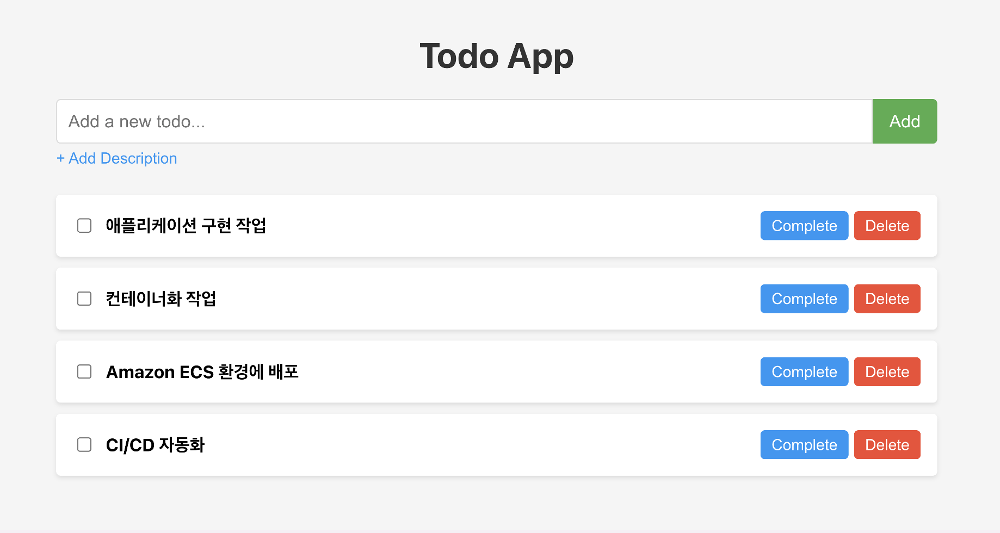

# Step-1. To-do 애플리케이션 개발

## 실습 개요
이 실습에서는 Amazon Q CLI를 사용하여 To-do 애플리케이션을 개발하는 방법을 배웁니다. 그리고 컨테이너화된 애플리케이션 로컬 환경에서 테스트를 해보도록 합니다.



### 1. 애플리케이션 개발
EC2에 연결해서 아래 명령어로 q chat를 실행합니다.
```bash
q chat
```

#### Amazon Q CLI를 활용해서 개발
Step 1에서 개발한 애플리케이션을 AWS 클라우드에 배포하기 위해 아키텍처를 설계하고 IaC코드를 생성해 봅니다.

### Step 3. Amazon ECS 환경 배포 및 검증
Amazon ECS 환경에 애플리케이션 배포해보고 실제 동작을 확인해 봅니다.

