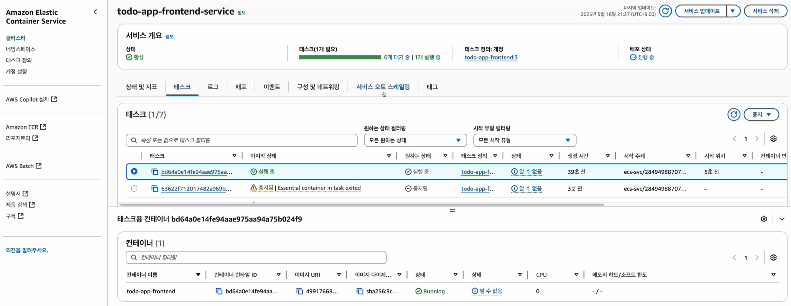
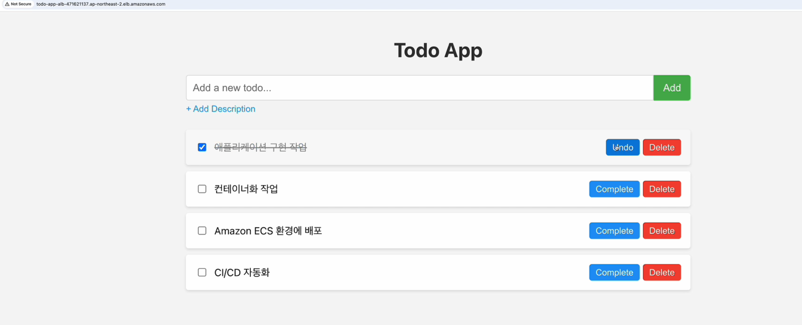
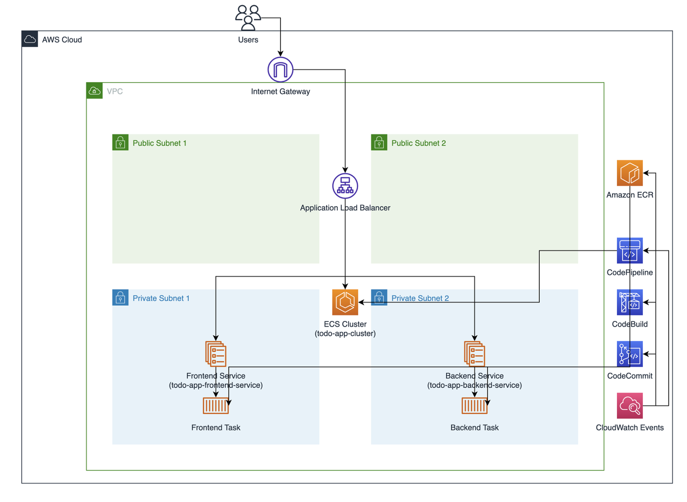

# Step-2. AWS 클라우드 아키텍처 설계 및 구축

## 실습 개요
이 실습에서는 앞서 구축된 AWS 클라우드 환경에 우리의 todo-app을 Amazon Q CLI의 도움을 받아 배포하는 실습을 진행합니다.

### 1.todo-app을 Amazon ECS에 배포
```bash
q chat
```

아래와 같이 Amazon Q CLI를 활용해서 애플리케이션을 배포를 요청합니다.
```bash
ECS클러스터가 정상적으로 배포된 것을 확인해어. frontend와 backend 소스코드를 docker build해서 ECR에 업로드하고, ECS에 배포할 수 있을까?
```


### 2. AWS 콘솔에서 확인
AWS 콘솔을 통해서 frontend, backend 컨테이너 이미지와 Amazon ECS 서비스, 태스크가 정상적으로 배포되었는지 확인을 합니다.



만약, 우리가 여기서 어려움을 겪고 있다면? 여러분들은 Amazon Q CLI를 활용해서 해결하실 수 있습니다.


### 3. 애플리케이션 동작 확인
웹 브라우저를 통해서 생성된 ALB 주소로 애플리케이션의 동작을 확인합니다.



### 4. AWS 클라우드 아키텍처 생성
현재 구성된 내용을 AWS 클라우드 아키텍처를 통해서 확인해 보는 시간을 갖도록 하겠습니다.
```bash
q chat
```

아래와 같이 Amazon Q CLI에서 AWS 아키텍처 생성을 요청합니다.
```bash
현재 생성한 ECS 아키텍처를 draw.io형태로 아키텍처를 작성해줘
```

구성된 아키텍처를 확인합니다.
