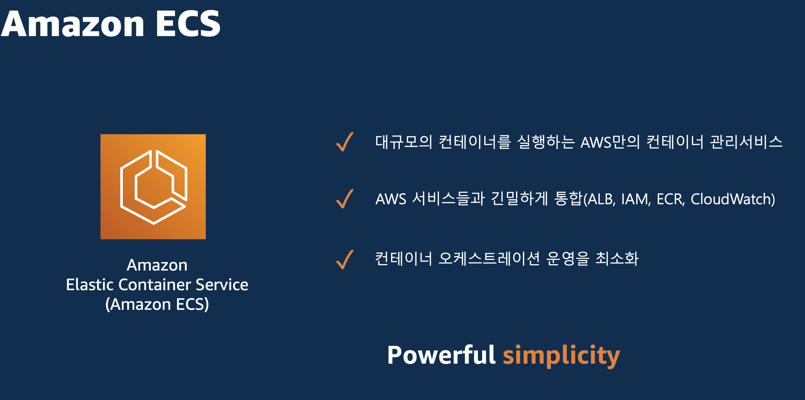
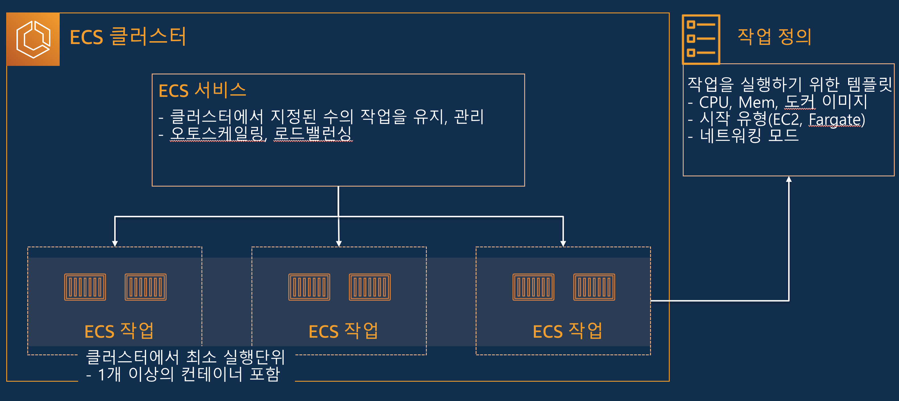

# Step-2. AWS 클라우드 아키텍처 설계 및 구축

## 실습 개요
이 실습에서는 앞서 개발한 애플리케이션을 Amazon Q CLI를 활용하여 AWS 클라우드 환경에 구축할 수 있습니다. AWS 클라우드 아키텍처를 설계해보고, Infrastructure ad Code(IaC) 구축해 볼 수 있습니다. 그리고 Amazon Q CLI를 통해서 아키텍처를 분석하는 방법을 실습합니다.

### Amazon ECS 소개
Amazon ECS는 AWS에서 컨테이너화된 애플리케이션을 쉽게 배포하고, 유연하게 확장할 수 있도록 지원하는 완전 관리형 컨테이너 오케스트레이션 서비스입니다. Amazon ECS의 가장 큰 장점은 강력하면서 운영의 효율화입니다.

Amazon ECS클러스터는 AWS 콘솔, AWS CloudFormation와 같은 IaC 와 같으 코드로 생성 및 관리가 가능합니다.



Amazon ECS구성요소는 ECS 클러스터와 ECS 서비스, 그리고 ECS Task로 구성되어 있습니다. 각각의 구성 요소에 대해서 살펴보면, 우선 클러스터는 ECS의 Task가 실행되는 논리적인 그룹입니다. 태스크는 애플리케이션을 구성하는 하나 이상의 컨테이너로 구성되며, JSON 형식의 작업 정의 텍스트 파일을 통해서 생성할 수 있습니다.
 
그리고 ECS서비스는 ECS 클러스터에서 원하는 수의 태스크를 동시에 실행하고 유지할 수 있습니다. 혹시 태스크가 어떤 이유로든 실패하거나 중지하면 Amazon ECS 서비스 스케줄러가 작업 정의에 따라 다른 인스턴스를 시작하는 방식으로 작동합니다. 이로써 서비스는 원하는 수의 태스크를 유지할 수 있습니다.

**Amazon ECS 구성요소**



### 1. Amazon ECS 구성 및 배포
EC2에 연결해서 아래 명령어로 q chat를 실행합니다.
```bash
q chat
```

아래와 같이 프롬프트를 작성해서 Amazon ECS 구성을 요청합니다.
```bash
todo-app 애플리케이션을 Amazon ECS에 배포하고 싶은데, ECS를 배포하기 위한 IaC코드를 테라폼 기반으로 만들어 주고 실행방법도 가이드 해줘
```

### 2. AWS 서비스 배포

테라폼이 설치가 되어 있지 않다면, Amazon Q CLI에게 테라폼 설치도 요청해보세요.
```bash
테라폼 설치해줘
```
```bash
terraform 설치해줘
```

정상적으로 테라폼이 설치가 되었다면, terraform 경로로 이동해서 EC2환경에서 terraform 을 실행해 봅니다.
```bash
terraform init
```
```bash
terraform plan
```
```bash
terraform apply
```

**[Troubleshoting]**

Amazon Q CLI는 동일한 프롬프트를 입력해도 결과가 모두 상이할 수 있습니다. 한 번에 완성된 코드를 제공할 수도 있지만, 몇 번의 디버깅이 필요한 경우도 있습니다. "Amazon Q CLI 채팅을 하면서 문제를 해결해 보세요"

#### [샘플 코드 제공]
실습 시간 내에 해결되지 않을 경우, [첨부파일](../../others/terraform/terraform.zip) 다운받아서 애플리케이션 내에 구성하고 위의 테라폼 명령어를 실행한다.

### 3. 생성된 AWS 서비스 확인
VPC 구성, Amazon ECS, 컨테이너 레지스트리 등을 확인해 봅니다.
- AWS 콘솔에서 직접 확인해 봅니다.
- Amazon Q CLI에게 terraform을 통해서 배포된 사항에 대해서 확인을 요청해 봅니다.


### 4. 애플리케이션 AWS 클라우드에 배포
```bash
q chat
```

아래와 같이 Amazon Q CLI를 활용해서 애플리케이션을 배포를 요청한다.
```bash
ECS클러스터가 정상적으로 배포된 것을 확인해어. frontend와 backend 소스코드를 docker build해서 ECR에 업로드하고, ECS에 배포할 수 있을까?
```

### 3. HTTP 연결 확인
먼저 HTTP를 통해 EC2 인스턴스 Public IP를 통해 접속할 수 있는 확인합니다.
```
# curl 명령을 사용하여 HTTP 연결 확인
curl http://<EC2-instance-pubic-IP>

# 또는 브라우저에서 확인
http://<EC2-instance-pubic-IP>
```

### 4. Amazon Q CLI를 활용하여 문제 진단
정상적으로 애플리케이션을 확인할 수 있도록 수정해야 합니다. 현재 애플리케이선을 접속하기 위해서는 어떤 동작이 필요할까요? Amazon Q CLI를 활용해서 해결해 보세요!

EC2에 연결해서 아래 명령어로 q chat를 실행합니다.
```bash
q chat
```
채팅을 통해 현재 경험하고 있는 문제를 진단하고 해결합니다.

**[예제]**
```
현재 <EC2-instance-pubic-IP> 인스턴스의 애플리케이션 브라우저로 접속이 되지 않아. 해결해 줄 수 있어?
```
```
<EC2-instance-pubic-IP> 인스턴스에서 실행되는 애플리케이션이 웹 브라우저에서 접속할 수가 없는데, 확인해
브라우저로 접속이 되지 않아. 해결해 줘
```

### 5. 문제 해결
Amazon Q CLI의 권장 사항에 따라 다음 문제를 해결합니다:
- 보안 그룹 구성 검토: 웹 접근을 허용하는 규칙 추가
- 네트워크 ACL 검토: 필요한 인바운드 및 아웃바운드 트래픽을 허용하도록 네트워크 ACL 검토

### 6. 연결 확인
위 단계를 완료한 후, SSH를 통해 EC2 인스턴스에 다시 연결을 시도하여 문제가 해결되었는지 확인합니다:
```
# curl 명령을 사용하여 HTTP 연결 확인
curl http://<EC2-instance-pubic-IP>

# 또는 브라우저에서 확인
http://<EC2-instance-pubic-IP>
```
