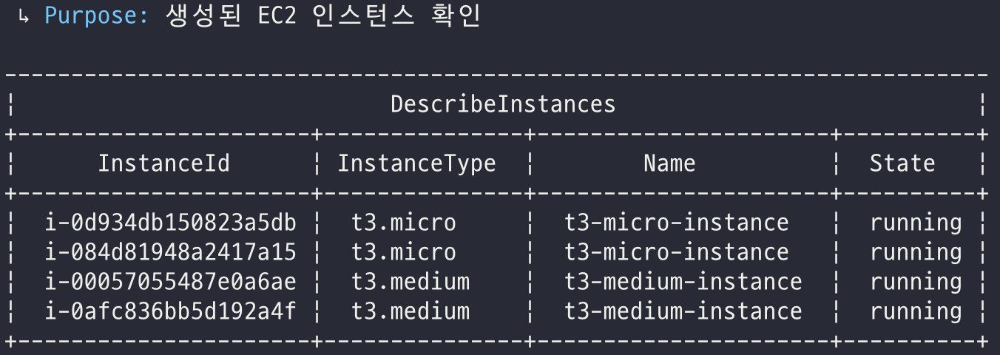
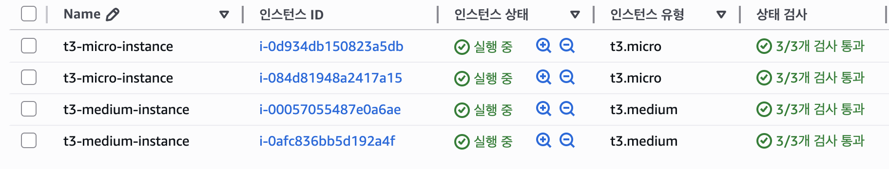
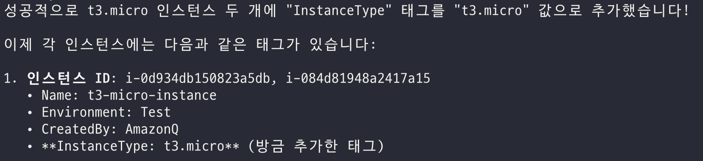
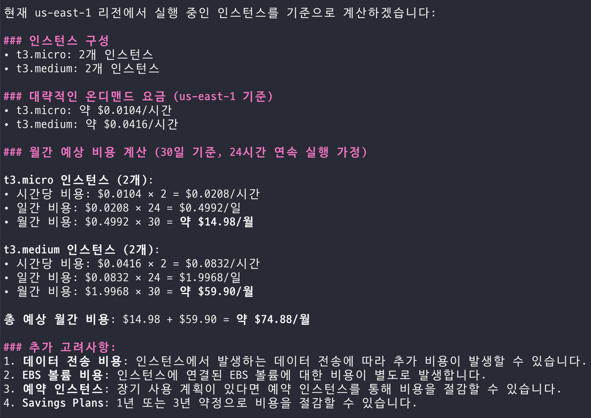
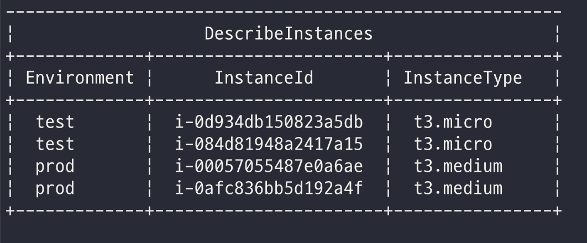
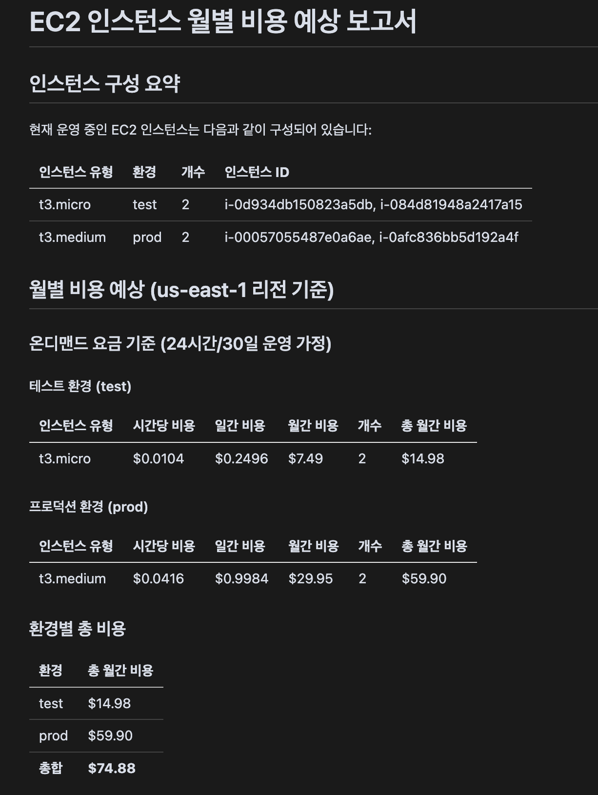
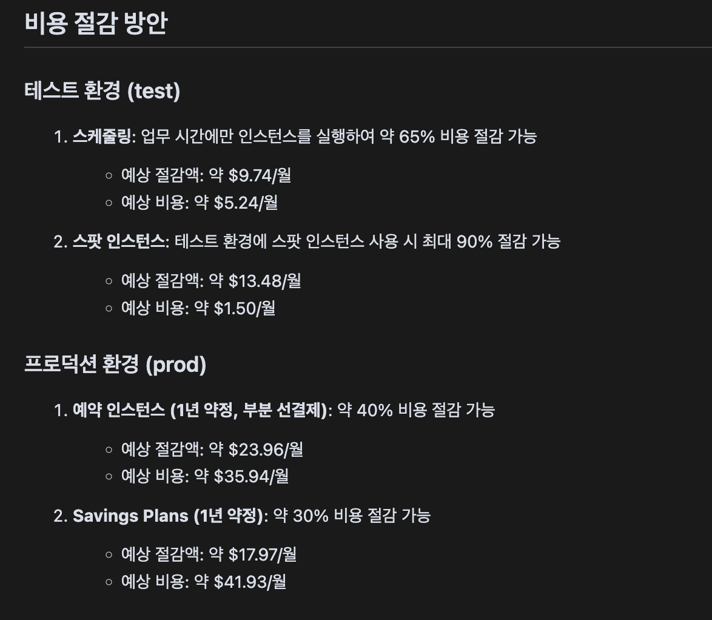

# 서비스 운영 효율화 및 문제 해결

## Amazon Q Developer CLI를 활용

### 01. Amazon Q Developer CLI를 활용한 인스턴스 생성

Amazon Q Developer CLI를 활용해서 EC2 인스턴스를 생성해겠습니다.
Amazon Q Developer CLI 환경에서 아래와 같이 요청해보겠습니다. 

```bash
t3.micro 2개, t3.medium 2개 생성해줘.
```
인스턴스 타입에 맞춰서 2개씩 생성해주는 모습입니다.


콘솔에서 EC2를 확인해보면 아래와 같이 잘 생성된 것을 확인할 수 있습니다.



### 02. Amazon Q Developer CLI를 활용한 인스턴스 태깅 작업

생성한 EC2에 태깅 작업을 진행해보겠습니다. 
우선 인스턴스 타입을 태깅에 추가해보겠습니다. 
```bash
방금 생성한 t3.micro 인스턴스에 t3.micro라고 태깅 붙여줘. 
```



### 03. Amazon Q Developer CLI를 활용한 인스턴스 타입별 예상 금액

인스턴스 타입별 예상 금액을 질의해볼 수 있습니다.
```bash
t3.micro, t3.medium 인스턴스 타입에 따라 이번달 인스턴스 금액을 예상해볼 수 있을까? 
```




### 04. Amazon Q Developer CLI를 활용한 Stage별 태깅 추가 작업

개발 환경과 운영 환경으로 구분하는 태깅을 추가해보겠습니다.
```bash
t3.micro에는 test, t3.medium에는 prod라고 태깅을 붙여줘.
```
이렇게 여러 환경이 공존하는 경우, 혹은 여러 서비스가 공존하는 경우
태깅 작업을 통해 환경별, 서비스별 예상 금액을 확인하시고 싶어하는 용도에 적용해 볼 수 있습니다. 




### 05. Amazon Q Developer CLI를 활용한 인스턴스 타입별, Stage별 예상 금액 md 파일로 생성

이번에는 예상 금액을 마크다운(md) 파일료 요청해보겠습니다. 
```bash
t3.micro, t3.medium 인스턴스를 InstanceType, Environment를 고려해서 월별 예상 금액을 뽑고 싶어. 그리고 그 결과를 md 파일 형태로 받고 싶어.
```


