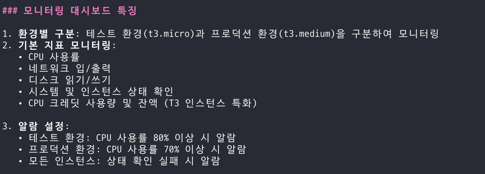
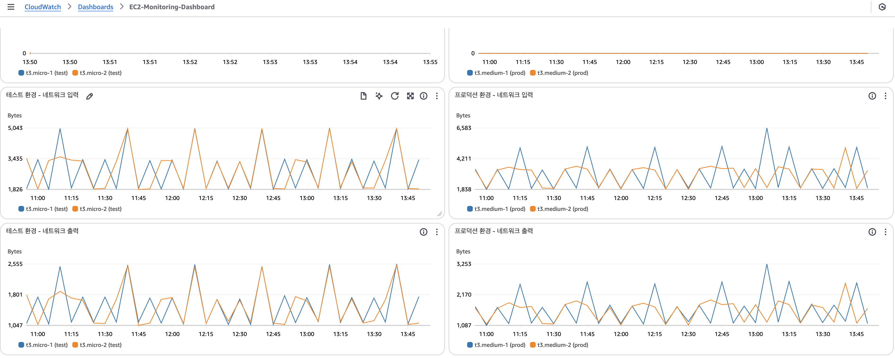
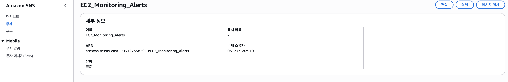
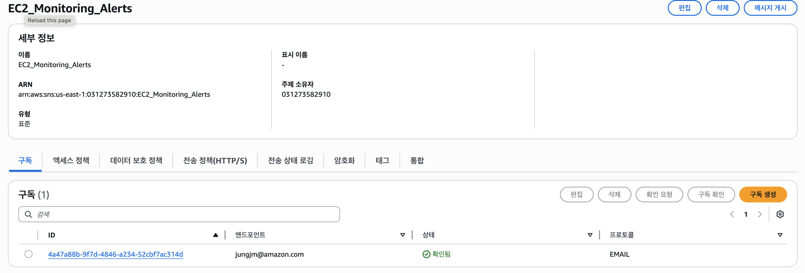
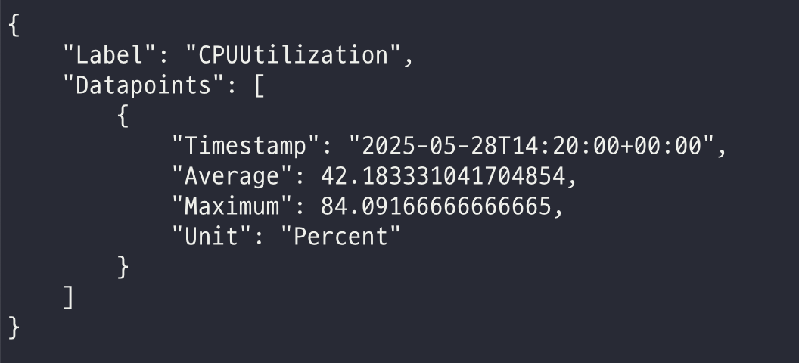
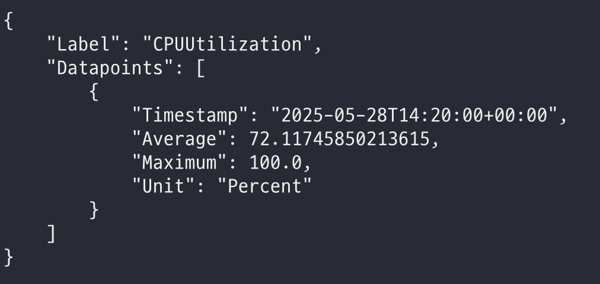
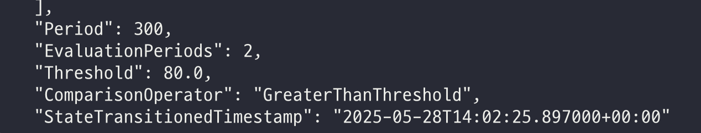
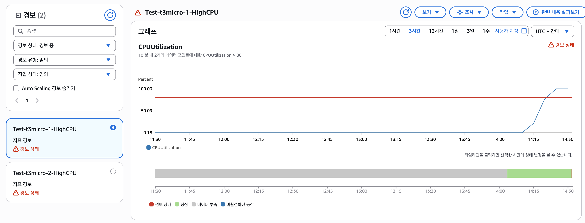
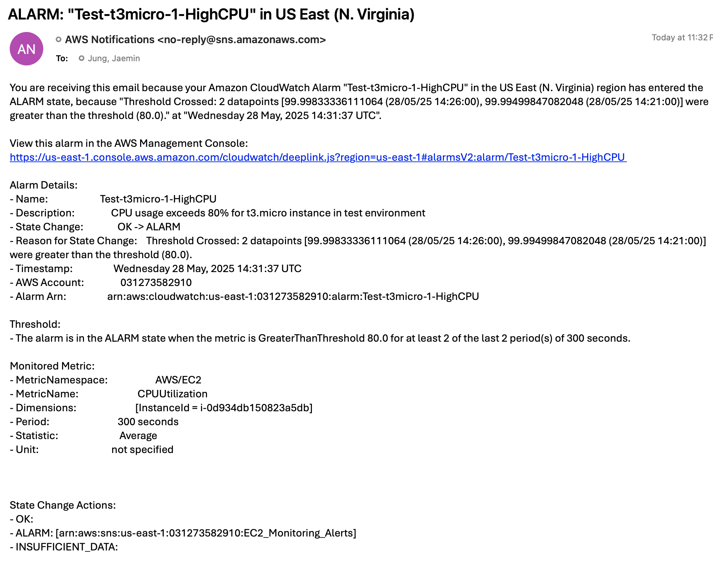

# 서비스 운영 효율화 및 문제 해결

## Amazon Q Developer CLI를 활용

### 01. Amazon Q Developer CLI를 활용한 인스턴스 모니터링 환경 구축

앞서 생성한 EC2 인스턴스를 모니터링 할 수 있는 환경을 만들어 보겠습니다.  
CloudWatch에 모니터링 항목을 구성하고 싶다고 요청해보겠습니다. 

```bash
t3.micro, t3.medium 인스턴스를 모니터링하는 cloudwatch 대시보드를 구성하고 싶어. CPU, RAM 및 다양한 모니터링 항목을 구성하고 싶어.
```



콘솔에서 CloudWatch 대시보드가 생성된 것을 확인할 수 있습니다.



### 02. Amazon Q Developer CLI를 활용한 인스턴스 알람 설정

EC2 인스턴스의 CPU 사용률이 특정 수준을 넘어서는 경우, 알람을 받을 수 있도록 요청해보겠습니다. 
```bash
테스트 환경과 운영 환경별로 CPU 사용률이 80%, 70% 이상일 때 알람을 받을 수 있도록 설정해줘.
```



알람을 받을 본인의 이메일 계정을 넣어서 Amazon SNS 구독에 등록해보겠습니다. 
```bash
내 메일은 your-email-address@example.com인데 이걸 구독에 등록해줘.
```
메일로 수신된 구독 내용을 확인해주시면, 콘솔에서 아래와 같이 EMAIL로 구독이 확인된 것을 볼 수 있습니다.



### 03. Amazon Q Developer CLI를 활용한 CPU 부하 테스트

CPU 부하를 높여서, 알람이 발생하는 상황을 구현해보겠습니다.  
```bash
그럼 테스트 환경에 CPU 부하를 80% 이상으로 줄 수 있도록 스크립트를 생성해서 10분 간 실행해줘.
```

ssm run command를 활용해서 원격에서 대상 EC2에 부하 테스트를 진행해보겠습니다.
```bash
ssm run command 활용해서 네가 실행해줘
```

CPU 사용률이 점점 증가하는 모습을 보입니다. 



5분 내에 80% Threshold를 2번 초가하게 되면 경보가 발생하게 됩니다. 


CPU 사용률이 80%를 초과해서 경보가 발생하였습니다. 


Amazon SNS 통해 메일로 알람을 수신하였습니다.
