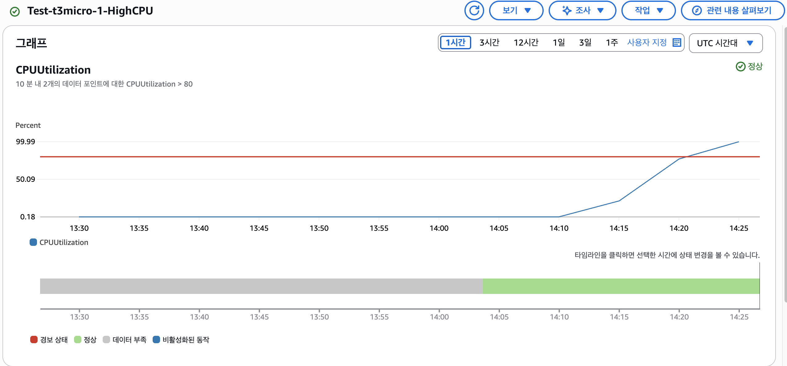

# 서비스 운영 효율화 및 문제 해결

## Amazon Q Developer CLI를 활용

### 01. Amazon Q Developer CLI를 활용한 인스턴스 모니터링 환경 구축

```bash
t3.micro, t3.medium 인스턴스를 모니터링하는 cloudwatch 대시보드를 구성하고 싶어. CPU, RAM 및 다양한 모니터링 항목을 구성하고 싶어.
```


### 02. Amazon Q Developer CLI를 활용한 인스턴스 알람 설정

```bash
테스트 환경과 운영 환경별로 CPU 사용률이 80%, 70% 이상일 때 알람을 받을 수 있도록 설정해줘.
```


```bash
내 메일은 jungjm@amazon.com인데 이걸 구독에 등록해줘.
```


### 03. Amazon Q Developer CLI를 활용한 CPU 부하 테스트

```bash
그럼 테스트 환경에 CPU 부하를 80% 이상으로 줄 수 있도록 스크립트를 생성해서 10분 간 실행해줘.
```




