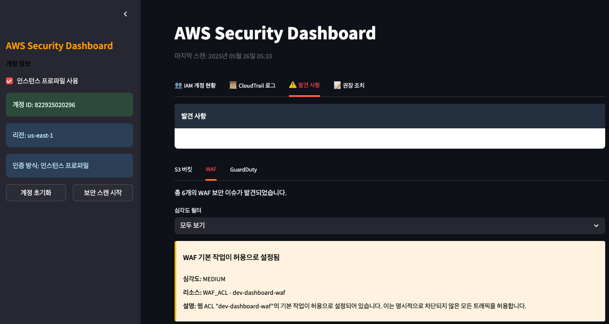

# 보안 점검 및 모니터링

# Lab3. 보안 점검 및 모니터링
### Step-1. Security Dashboard 구동하기
100% Amazon Q Developer만 활용하여 개발한 AWS Security Dashboard 입니다. 이 Dashboard를 통해서 AWS Account내 존재하는 위협요소를 스캔하고 그 발견된 위협요소를 다시 Amazon Q Developer 로 해결해 보는 과정입니다.

- Lab3에서는 실습용 Account를 대시보드에 인증하고 해당 Account내 존재하는 S3, WAF, Guardduty 등에서 발생하는 Low Medium High 등급의 위협요소를 찾아봅니다.
- 그 결과는 발견사항 탭에서 확인할 수 있으며 S3, WAF, Guardduty 영역별로 분류된 위협요소를 확인합니다.
- 권장조치 탭에서 High로 분류된 위협요소에 대해서는 Amazon Q Developer의 도움을 받아 해결해 보는 과정을 경험해 봅니다.
- (option)여러분의 랩탑환경에 해당 Source를 받아서 Amazon Q Developer의 도움을 받아서 이 Dashboard의 추가기능을 개발해 보세요.

