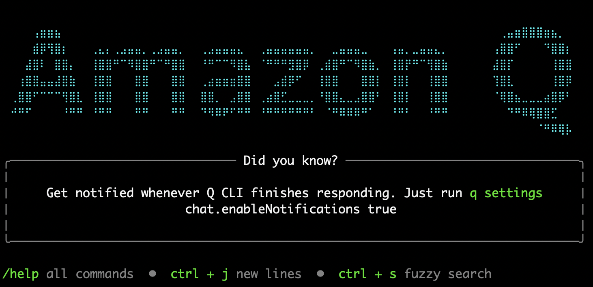

# AgenticOps using Amazon Q Developer

안녕하세요. AWS AI 코딩 어시스턴트를 활용한 IT 서비스 구축, 운영을 효과적으로 개선하기 위한 Workshop에 오신 것을 환영합니다!

현대의 IT 인프라 환경은 그 규모와 복잡성이 기하급수적으로 증가하고 있습니다. 클라우드 네이티브 아키텍처의 도입이나 마이크로서비스 기반 애플리케이션의 확산으로 기업의 IT 운영팀이 대응해야 할 영역은 지속적으로 확장되고 있습니다.

이 Workshop은 Amazon Q Developer를 활용해서 IT 운영의 일상적인 업무를 자동화하고, 효율성을 극대화할 수있는 방법을 직접 구현해 보기 위해 제작 되었습니다.

대상: IT서비스 운영자 및 개발자
예상 소요 시간: 2시간
이 Workshop을 통해 여러분은 AWS 기반의 생성형 AI서비스들을 활용하여 상호작용하는 과정을 실습하게 됩니다.

## Workshop 소개
이 Workshop에서는 AWS 서비스를 자동으로 구축해보고, 운영 환경에서 다양한 문제를 해결하기 위해 Amazon Q CLI를 사용하는 방법을 사용자들이 학습할 수 있도록 설계된 일련의 실습들을 포함하고 있습니다.

