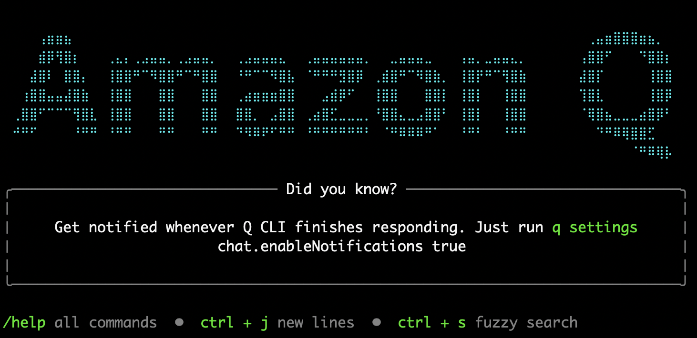

# AgenticOps using Amazon Q Developer

안녕하세요. AWS AI 코딩 어시스턴트를 활용한 IT 서비스 구축, 운영을 효과적으로 개선하기 위한 Workshop에 오신 것을 환영합니다!

현대의 IT 인프라 환경은 그 규모와 복잡성이 기하급수적으로 증가하고 있습니다. 클라우드 네이티브 아키텍처의 도입이나 마이크로서비스 기반 애플리케이션의 확산으로 기업의 IT 운영팀이 대응해야 할 영역은 지속적으로 확장되고 있습니다.

이 Workshop은 Amazon Q Developer를 활용해서 IT 운영의 일상적인 업무를 자동화하고, 효율성을 극대화할 수있는 방법을 직접 구현해 보기 위해 제작 되었습니다.

대상: IT서비스 운영자 및 개발자
예상 소요 시간: 2시간
이 Workshop을 통해 여러분은 AWS 기반의 생성형 AI서비스들을 활용하여 상호작용하는 과정을 실습하게 됩니다.

## Workshop 소개
이 Workshop에서는 AWS 서비스를 자동으로 구축해보고, 운영 환경에서 다양한 문제를 해결하기 위해 Amazon Q CLI를 사용하는 방법을 사용자들이 학습할 수 있도록 설계된 일련의 실습들을 포함하고 있습니다.

## Amazon Q CLI
### Amazon Q CLI란 무엇인가요?
Amazon Q CLI는 Amazon Q의 기능을 명령줄 인터페이스로 가져오는 명령줄 도구입니다. Amazon Q CLI를 사용하면 다음과 같은 작업을 수행할 수 있습니다:

- AWS 서비스에 대한 도움말 및 권장 사항 얻기
- AWS 리소스 관련 문제 진단 및 해결
- AWS CLI 명령 생성 및 해석
- AWS 모범 사례에 대한 지침 받기
- 대화형 방식으로 AI 어시스턴트와 상호 작용

### 실습 목록
이 Workshop에는 다음과 같은 실습이 포함되어 있습니다:
1. 클라우드 아키텍처 설계 및 구축
2. 서비스 운영 효율화 및 문제 해결
3. 보안 점검 및 모니터링

### 사전 요구 사항
실습을 시작하기 전에 다음 사항을 확인하세요:
1. AWS CLI가 설치되고 구성되어 있어야 합니다.
2. Amazon Q Developer CLI가 설치되어 있어야 합니다.
3. 실습에서 사용되는 리소스를 생성하고 관리할 수 있는 필요한 AWS 권한이 있어야 합니다.
